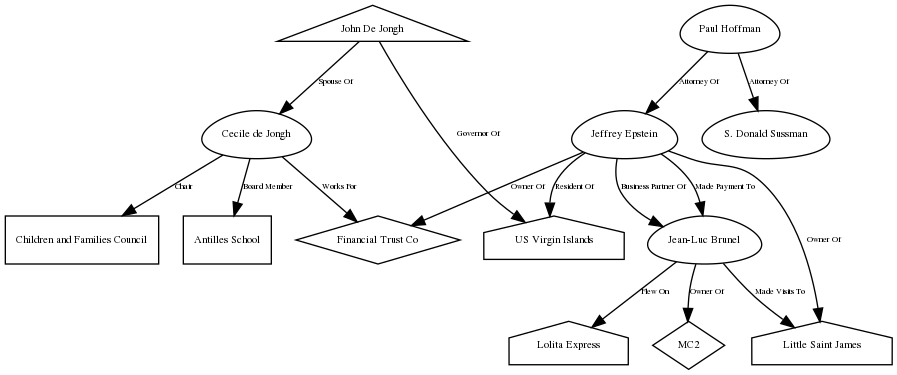

# RelationshipMap
Python tool for easily mapping entity relationships.

This repo includes an example Openoffice Calc file with the expected sheets and formats.

Installation:

```
git clone https://github.com/RussShackleson/RelationshipMap.git
cd RelationshipMap
pip3 install -r requirements.txt
```

Usage:

`python3 RelationshipMap.py <ods file>`

Example:

`python3 RelationshipMap.py epstein_relationshipmap.ods`

Output:


